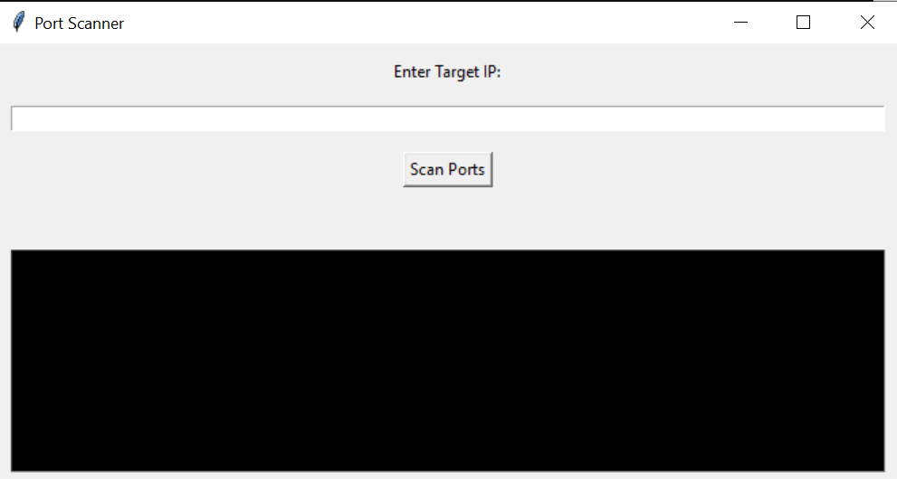

# Port Scanner

Port Scanner is a simple graphical application for scanning open ports on a target IP address. It allows you to quickly identify which ports are open on a specific device.

## Features

- Scans a range of common ports on a target IP address.
- Provides real-time feedback on open ports.
- Offers a user-friendly graphical interface for ease of use.
- Utilizes multithreading for faster scanning.

## Requirements

- Python 3.x
- Tkinter (for the graphical user interface)

## Getting Started

1. Clone this repository to your local machine:
git clone https://github.com/Ianemwel679/portscanner.git

2. Install the required libraries:
pip install tkinter

3. Run the application:
python scanner.py

## Usage

1. Launch the Port Scanner application.
2. Enter the target device's IP address in the provided field.
3. Click the "Scan Ports" button to start the scanning process.
4. The open ports will be displayed in the result label.
5. The console below provides real-time feedback on the scanning process.

## Configuration

You can adjust the following parameters in the `scanner.py` file to customize the scanning behavior:

- `num_threads`: The number of threads used for concurrent scanning. Adjust this value based on your system's capabilities.
- `common_ports`: A list of common ports to scan. Modify this list to include additional ports if needed.

## Troubleshooting

If you encounter any issues or errors while using the Port Scanner, please check the console for error messages. Common issues include network connectivity problems or timeouts.

## License

This project is licensed under the MIT License - see the [LICENSE](LICENSE) file for details.

## Contributing

Contributions to this project are welcome! Please feel free to open issues, submit pull requests, or provide feedback.

